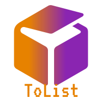
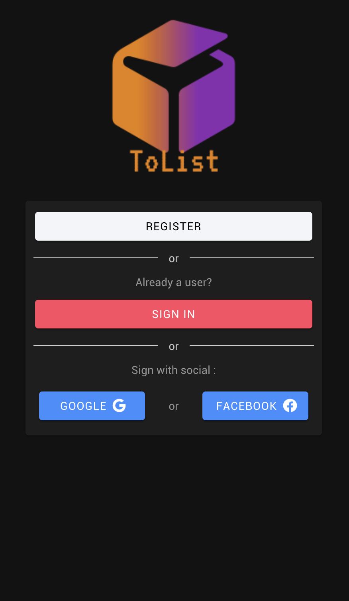
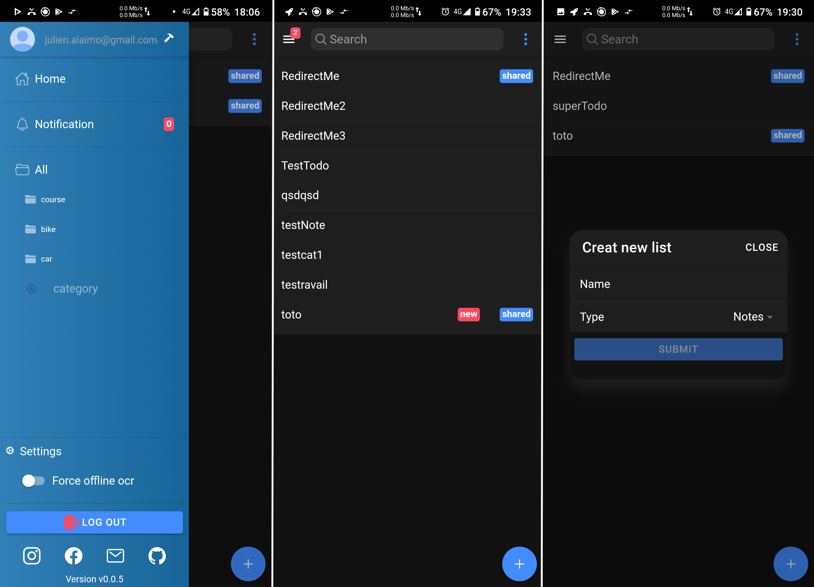

[![Contributors][contributors-shield]][contributors-url]
[![Forks][forks-shield]][forks-url]
[![Stargazers][stars-shield]][stars-url]
[![Issues][issues-shield]][issues-url]
[![MIT License][license-shield]][license-url]
[![LinkedIn][linkedin-shield]][linkedin-url]

[](https://github.com/A-Julien/MobileApp/actions/workflows/firebase-hosting-merge.yml)
<br />
<p align="center">
  <a href="https://github.com/A-Julien/MobileApp">
    
  </a>

<h3 align="center">ToList</h3>

<p align="center">
A simple todo list App with O.C.R support 
<br />
<a href="https://mobileapp-e7f03.web.app/loginRegister"><strong>Explore the App »</strong></a>
<br />
<br />
<a href="https://github.com/A-Julien/MobileApp/issues">Report Bug</a>
·
<a href="https://github.com/A-Julien/MobileApp/issues">Request Feature</a>
</p>
</p>


<!-- TABLE OF CONTENTS -->
<details open="open">
  <summary><h2 style="display: inline-block">Table of Contents</h2></summary>
  <ol>
    <li>
      <a href="#about-the-project">About The Project</a>
      <ul>
        <li><a href="#built-with">Built With</a></li>
      </ul>
    </li>
    <li>
      <a href="#getting-started">Getting Started</a>
      <ul>
        <li><a href="#prerequisites">Prerequisites</a></li>
        <li><a href="#installation">Installation</a></li>
      </ul>
    </li>
    <li><a href="#usage">Usage</a></li>
    <li><a href="#roadmap">Roadmap</a></li>
    <li><a href="#contributing">Contributing</a></li>
    <li><a href="#contact">Contact</a></li>
    <li><a href="#acknowledgements">Acknowledgements</a></li>
  </ol>
</details>


<!-- ABOUT THE PROJECT -->
## About The Project

<kbd></kbd>

Tolist i s simply PWA. Tolist are deployed natively with Capacitor.

<kbd></kbd>

You can add List; share List with other user. You have a minimal side menu. App style in dev !

## OCR 

<kbd></kbd>

You can use OCR in todo. The app allow you to crop your picture. Tolist use the GoogleVisionApi to make ocr
detection. If you car about your personal info, you can force the offline ocr mode (Use Tesseract JS).
But it will be less accurate and longer !


### Firebase 
### Collections
* List -> contain all info for a list and a subCollection of todo.
* Share -> we create 1 element when a user share a list with another user. That allow us to make notifications.
* UserSetting -> Store user settings

### Security configuration


<!-- GETTING STARTED -->
## Getting Started

To get a local copy up and running follow these simple steps.

### Prerequisites

* npm
  ```sh
  npm install npm@latest -g
  ```
* ionic
  ```sh
  npm install -g @ionic/cli
  ```
* capacitor

### Installation

1. Clone the repo
   ```sh
   git clone https://github.com/A-Julien/MobileApp.git
   ```
2. Install NPM packages
   ```sh
   npm install
   ```
3. Start development server
   ```sh
   ionic serve
   ```

## Usage


## Roadmap

See the [open issues](https://github.com/A-Julien/MobileApp/issues) for a list of proposed features (and known issues).


<!-- CONTRIBUTING -->
## Contributing

Contributions are what make the open source community such an amazing place to be learn, inspire, and create. Any contributions you make are **greatly appreciated**.

1. Fork the Project
2. Create your Feature Branch (`git checkout -b feature/AmazingFeature`)
3. Commit your Changes (`git commit -m 'Add some AmazingFeature'`)
4. Push to the Branch (`git push origin feature/AmazingFeature`)
5. Open a Pull Request


<!-- CONTACT -->
## Contact

Alaimo Julien - [julien.alaimo@gmail.com](julien.alaimo@gmail.com) - email
Hugo Feydel - []() - email

Project Link: [https://github.com/A-Julien/MobileApp](https://github.com/A-Julien/MobileApp)


<!-- ACKNOWLEDGEMENTS -->
## Acknowledgements

* []()
* []()
* []()


<!-- MARKDOWN LINKS & IMAGES -->
<!-- https://www.markdownguide.org/basic-syntax/#reference-style-links -->
[contributors-shield]: https://img.shields.io/github/contributors/A-Julien/MobileApp.svg?style=for-the-badge
[contributors-url]: https://github.com/A-Julien/MobileApp/graphs/contributors
[forks-shield]: https://img.shields.io/github/forks/A-Julien/MobileApp.svg?style=for-the-badge
[forks-url]: https://github.com/A-Julien/MobileApp/network/members
[stars-shield]: https://img.shields.io/github/stars/A-Julien/MobileApp.svg?style=for-the-badge
[stars-url]: https://github.com/A-Julien/MobileApp/stargazers
[issues-shield]: https://img.shields.io/github/issues/A-Julien/MobileApp.svg?style=for-the-badge
[issues-url]: https://github.com/A-Julien/MobileApp/issues
[license-shield]: https://img.shields.io/github/license/A-Julien/MobileApp.svg?style=for-the-badge
[license-url]: https://github.com/A-Julien/MobileApp/blob/master/LICENSE.txt
[linkedin-shield]: https://img.shields.io/badge/-LinkedIn-black.svg?style=for-the-badge&logo=linkedin&colorB=555
[linkedin-url]: https://linkedin.com/in/A-Julien
